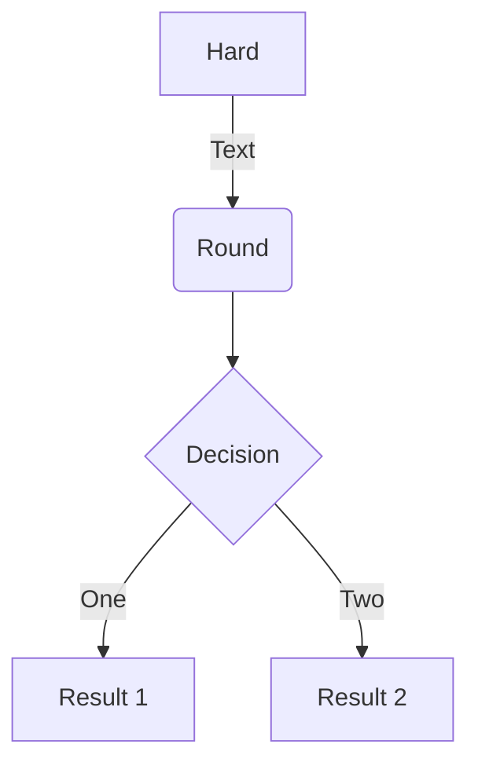

# Welcome to MkDocs

- [X] item 1
    * [X] item A
    * [ ] item B
        more text
        + [x] item a
        + [ ] item b
        + [x] item c
    * [X] item C
- [ ] item 2
- [ ] item 3

---

[=0% "0%"]
[=5% "5%"]
[=25% "25%"]
[=45% "45%"]
[=65% "65%"]
[=85% "85%"]
[=100% "100%"]

---

[=85% "85%"]{: .candystripe}
[=100% "100%"]{: .candystripe .candystripe-animate}

[=0%]{: .thin}
[=5%]{: .thin}
[=25%]{: .thin}
[=45%]{: .thin}
[=65%]{: .thin}
[=85%]{: .thin}
[=100%]{: .thin}

---

=== "Tab 1"
    Markdown **content**.

    Multiple paragraphs.

=== "Tab 2"
    More Markdown **content**.

    - list item a
    - list item b

---

???+ note "Open styled details"

    ??? danger "Nested details!"
        And more content again.

!!! summary "some summary"
    This is summary

---

??? success
   Content.

??? warning classes
   Content.

---

> ```
  a fenced block
  ```

---

-<space>
    ```
    a fenced block
    ```

Definition
:<space>
    ```
    a fenced block
    ```
---

```{.python .extra-class linenums="1"}
import hello_world
```
---



---

!!! note "Phasellus posuere in sem ut cursus"
    Lorem ipsum dolor sit amet, consectetur adipiscing elit. Nulla et euismod
    nulla. Curabitur feugiat, tortor non consequat finibus, justo purus auctor
    massa, nec semper lorem quam in massa.
!!! note "2"
    Lorem ipsum dolor sit amet, consectetur adipiscing elit. Nulla et euismod
    nulla. Curabitur feugiat, tortor non consequat finibus, justo purus auctor
    massa, nec semper lorem quam in massa.
