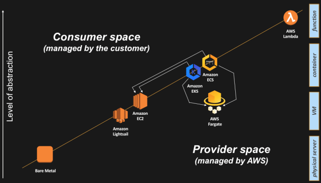

## Technical Architecture Diagrams

> A technical architecture diagram provides a bird’s eye view of the infrastructure of your organisation. The diagram illustrates how components in a system interact with one another in the large scale of things

- ✅ [Application Architecture Diagram](#--application-architecture-diagram--)
- ✅ [Integration Architecture Diagram](#---integration-architecture-diagram--)
- ✅ [Deployment Architecture Diagram](#--deployment-architecture-diagram--)
- ✅ [DevOps Architecture Diagram](#--devops-architecture-diagram--)
- ✅ [Data Architecture Diagram](#--data-architecture-diagram--)
- ✅ [Compute Abstractions Diagram](#--compute-abstractions-diagram--)

### **Application Architecture Diagram**

> Application architecture diagram provides a high-level overview of components to facilitate planning in the form of impact assessments based on the upgrading, replacing, and merging of applications.

An application architecture diagram comprises of a high-level overview of the components and fundamental interactions within the system, e.g. microservices, databases, etc.

#### Use Case

A common usage of this diagram is to facilitate planning and solutions implementation in the form of assessing the impact of upgrading, replacing or merging existing applications. With new applications continually being released into the market and promising increased efficiency and reduced cost (especially in the containerisation space), it’s vital to have an overview of the applications within your system.

#### Questions to Address

- What type of applications is in each cluster?
- What are the applications’ dependencies and interactions?
- What’s the intended outcome and desired state of the architecture?

#### Useful components in this diagram

- **Grouped components into layers and bounded contexts** — each boundary likely suggests a different stakeholder group, e.g. data engineers for the data layer, core platform team for common/shared services, etc. which provides an idea who to involve in the planning/discussions.
- **Annotations with additional information** — provide further details about how each cluster is managed and organised, e.g. based on the nature of applications and security concerns, etc. may be included to facilitate discussions.
- **Application details and context** — state name and types of applications to provide an idea on how applications are organised

### **Integration Architecture Diagram**

> Integration architecture diagram focuses on the integration protocols between the application components to facilitate the integration of internal/external partner systems.

#### Use Case

A common use of this diagram is to facilitate the integration of external systems by partners or other internal systems. With businesses establishing new partnerships via ecosystems these days to create mutual value these days, you may often have to work with partners to integrate systems together, e.g. e-commerce, payments, hotel bookings, flights, etc.

#### Questions to Address

- How are my services currently organised and exposed internally/externally?
- How does the partner want to integrate with my system, e.g. internal networks, protocols, etc.?
- How do I secure, track and manage the integration of my exposed services?

#### Useful components in this diagram

- **Grouped components into layers and bounded contexts** — an indication of internal/external API gateways and services
- **Annotations with additional information** — reference links to API catalogues where detailed service data attributes can be obtained to assess gaps
- **Application details and context** — services are named appropriately to allow quick assessment of requirements v.s. actual

### **Deployment Architecture Diagram**

> Deployment architecture diagram highlights the network boundaries and sizing of infrastructure components to facilitate planning and upgrading of applications and services for optimisation purposes.

A deployment architecture diagram consists of network boundaries and infrastructure hardware/software components. The size and quantity of the components are also sometimes specified in order to facilitate planning.

#### Use Case

A common use of this diagram is to facilitate the upgrading of applications and services to handle the additional load or the optimisation of resources. Over time, as more users from various parts of the world start using your applications and services, your existing resources may not be able to handle the increased scale and load.

#### Questions to Address

- How many AZ?
- Where to deploy the instance?
- How large would the new instance be?

#### Useful components in this diagram

- **Network boundaries** — showcases the isolation of components and potential connectivity implications.
- **Instance sizing** — indicates the sizing of the machines to facilitate optimisation and benchmarking of resources with respect to performance requirements.
- **Show parts of external integration** — showcase the system’s extension (if any) to other systems and networks to indicate a larger picture and facilitate streamlining of resources, i.e. common/shared services, etc. and collaboration opportuni

### **DevOps Architecture Diagram**

> DevOps architecture diagram illustrates the flow of processes involving systems and humans across deployment environments to facilitate process improvements and automation.

A DevOps architecture diagram often comprises of system components, processes, and environments. The diagram resembles a process flow diagram illustrating the operations to ship a codebase/app to production

#### Use Case

A common use of this diagram is to facilitate the improvement of processes with regards to app deployments. The constant changes to systems architecture and improvements to deployment tools/methods, e.g. Containers, Serverless, etc. prompts a need to adapt existing DevOps architecture and processes to keep up with the times.

#### Questions to Address

- What’s the current process flow?
- How are configurations currently managed across applications?
- What are the types of applications to be deployed?

#### Useful components in this diagram

- **Showcase processes across environments** — DevOps usually span across environments, and it’s often useful to show the applications promotion processes.
- **Annotations with additional information** — further details for the respective stages and processes can be included to facilitate discussions and planning.
- **Decision gateways and user processes** — DevOps don’t only include system components and involves a large part of the human element to build a good DevOps culture; the human processes component cannot be ignored.

## **Data Architecture Diagram**

> Data architecture diagram showcases the flow of data across system components within an IT infrastructure and indicates how data is collected, processed, stored, and used to facilitate data systems optimisation.

A data architecture diagram contains components within a system that define how data is collected, processed, stored, and used. The diagram also illustrates the flow of data across system components within the IT infrastructure.

#### Use Case

One of the use cases of this diagram is to facilitate the upgrading of resources to optimise data collection and storage costs. With the increasing amount of data captured today and the cost of data storage getting cheaper, there are bound to be constant adjustments to the data architecture for organisations.

#### Questions to Address

- How is data being processed currently?
- Where is the data being stored and used?
- How much data are we talking about?

#### Useful components in this diagram

- **Display as-is and to-be components** — provides an overview of the changes at a quick glance to assess the impact and focus discussion points.
- **Indication of data increment rate** — gives stakeholders a sense of the scale of data for estimation and solution design purposes.
- **Logical grouping of components** — illustrates the objectives of the components at the various stages, e.g. processing, visualising, etc. to facilitate ease of readability.

## [**Compute Abstractions Diagram**][compute-abstractions]

> I was trying to find a way to explain, in the easiest way possible, all the options the platform offers to our users from a compute perspective. There are of course many ways to peal this onion and I wanted to create a “visual story” that was easy for me to tell.

The compute domain as "anything that has CPU and Memory capacity that allows you to run an arbitrary piece of code written in a specific programming language". It goes without saying that your mileage may vary in how you define it but this is a broad enough definition that should cover a lot of different interpretations.

#### Use Case

The reason for which the line above is oblique, is because it needs to intercept different compute abstraction levels. If you think about what happened in the last 20 years of IT, we have seen a surge of different compute abstractions that have changed the way people consume CPU and Memory resources. It all started with physical (x86) servers back in the eighties and then we have seen the industry adding a number of abstraction layers over the years (i.e. hypervisors, containers, functions).

As you can depict from the graphic below, the higher you go in the abstraction levels, the more the cloud provider can add value and can offload the consumer from non-strategic activities. A lot of these activities tend to be “undifferentiated heavy lifting”.

#### Questions to Address

- Some customers were (and still are) happy about being in full control of said instances. Are you one of them?

#### Useful components in this diagram

- **The bare metal abstraction** - Also known as the “no abstraction”.
- **The instance (or virtual machine) abstraction** - (Amazon EC2) is the service that allows AWS customers to launch instances in the cloud. When customers intercept the platform at this level, they retain responsibility of the guest Operating System and above (middleware, applications etc.) and their life-cycle. Similarly, customers leave to AWS the responsibility for managing the hardware and the hypervisor including their life-cycle.
- **The container abstraction** - In a nutshell, you can think of a container as a self-contained environment with soft boundaries that includes both your own application as well as the software dependencies to run it. Whereas an instance (or VM) virtualizes a piece of hardware so that you can run dedicated operating systems, a container technology virtualizes an operating system so that you can run separated applications with different (and often incompatible) software dependencies.
- **The full container abstraction (for lack of a better term)** - Practically speaking, Fargate is making the containers data plane fall into the "Provider space" responsibility. This means the compute unit exposed to the user is the container abstraction, while AWS will manage transparently the data plane abstractions underneath.
- **The function abstraction** - In the context of this blog post, the key point about Lambda is that you don’t have to manage the infrastructure underneath the function you are running. No need to track the status of the physical hosts, no need to track the capacity of the fleet, no need to patch the OS where the function will be running. In a nutshell, no need to spend time and money on the undifferentiated heavy lifting.

[compute-abstractions]: http://www.it20.info/2018/06/compute-abstractions-on-aws

